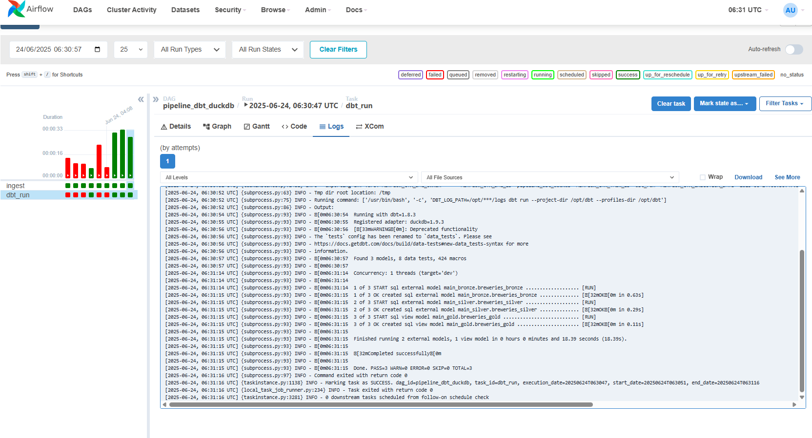
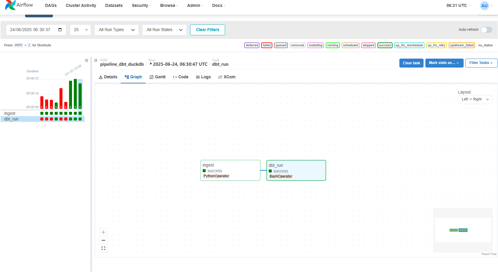

# Open Brewery Data Pipeline Project

## Project Objective

The objective of this project is to build a modern data pipeline by ingesting data from the public API [Open Brewery DB](https://www.openbrewerydb.org/), storing it in a **raw** layer on MinIO, and applying transformation and validation steps through the **bronze**, **silver**, and **gold** layers.

Data is processed and structured using **dbt**, which performs:

- Schema validation  
- Data type conversion  
- Column-level testing (e.g. uniqueness, not null)  
- Modular SQL transformations  
- Data lineage tracking between models  

The final output is saved in **Parquet format**, optimized for downstream analytics.

---

## Tech Stack

- **Apache Airflow** – Orchestration of the entire pipeline  
- **dbt (Data Build Tool)** – Data transformation and validation  
- **DuckDB** – Lightweight analytical database engine  
- **MinIO** – S3-compatible object storage (stores raw and processed data)  
- **Docker** – Containerized local development  
- **Parquet** – Efficient columnar storage for all layers  

---

## How to Run the Project

### Prerequisites
- [Docker](https://www.docker.com/) installed and running locally

### Steps

1. **Clone the repository**  
   ```bash
   git clone https://github.com/thiiagofaria/breweries_case.git
   cd breweries_case
   ```

2. **Start the services**  
   ```bash
   docker compose up --build
   ```

3. **Access Airflow**
   - URL: [http://localhost:8080](http://localhost:8080)  
   - User: `admin`  
   - Password: `admin`

4. **Access MinIO (S3 Storage)**
   - URL: [http://localhost:9001](http://localhost:9001)  
   - User: `minio`  
   - Password: `minio123`

---

## Execution Preview

### DAG Execution Flow in Airflow


### DAG Logs and dbt Model Execution


---

## Data Layers Overview

- **Raw**: Raw JSON from API stored in MinIO  
- **Bronze**: Parsed and structured data  
- **Silver**: Cleaned, deduplicated, and type-cast models  
- **Gold**: Business-ready data (e.g., aggregated or enriched)

All outputs are stored as **Parquet** files for optimal performance and interoperability.

---

## Optional: Querying with DBeaver or Other Tools

If you want to explore the transformed data manually, you can use a tool like **DBeaver**, **DuckDB CLI**, or any compatible SQL client to connect directly to the `.duckdb` file created by the pipeline.

Simply open the `.duckdb` file (located inside the container or mounted volume) and execute SQL queries on the final models in the **gold** layer.

This is helpful for ad hoc analysis or quick inspection of processed data.ured data  
- **Silver**: Cleaned, deduplicated, and type-cast models  
- **Gold**: Business-ready data (e.g., aggregated or enriched)

All outputs are stored as **Parquet** files for optimal performance and interoperability.

---